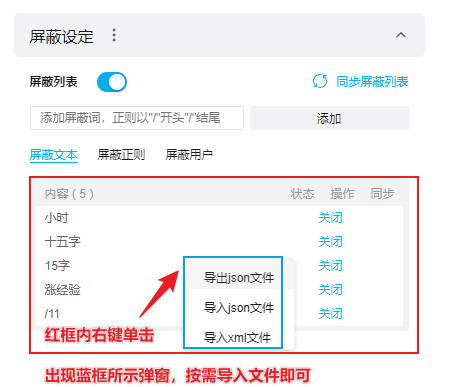

# 看啥呢喂
> 项目全名为：Kill sex from normal videos (KSNV)
>
> 舞蹈视频让你看舞蹈跳的怎么样，而你看啥呢喂！
>
> 歌曲视频让你听歌唱的怎么样，而你看啥呢喂！
>
> coser 视频让你看还原度怎么样，而你看啥呢喂！
>
> ……

[](./LICENSE)    

<hr/>

## 项目起源

因为在B站观看正常视频时经常有其他用户发送黄色笑话、性隐喻等恶意弹幕，非常影响观感。

所以创建此项目收集用于屏蔽黄色废料的关键词。

<hr/>

## 如何使用？

### 获取项目

#### 通过 clone 将仓库克隆到本地

1. 使用如下命令将仓库克隆到本地

```git
git clone git@github.com:xinhuoshixincha/kill-sex-from-normal-videos.git
```

#### 通过 release 直接下载文件

[](https://github.com/xinhuoshixincha/kill-sex-from-normal-videos/releases/tag/v1.0.12)

### 导入屏蔽词

#### xml 和 json 文件

##### B站网页版

  

**手机客户端需要手动输入（使用文本文件），pc客户端暂未找到屏蔽词入口**

<hr/>

## 规范

### 版本规范

初始版本 1.0.0

### 文件规范

此项目屏蔽词文件分为三种：

- 文本
- xml 文件
- json 文件

**推荐使用后两种**

在文件内，屏蔽词分为两种类型

- 文本匹配 --- 比如`沙发`屏蔽词只屏蔽`沙发`弹幕，类似于`沙发1`、`1沙发`、`沙1发`不屏蔽
  - 优点：简单
  - 缺点：无法批量屏蔽
- 正则匹配 --- 使用正则表达式进行屏蔽，匹配的弹幕全部屏蔽
  - 优点：可以批量屏蔽
  - 缺点：入手有难度

<hr/>

### 文本匹配书写规范

在 `/text/` 目录下的 `text-block-版本号.txt` 文件，每行代表一个屏蔽词。

```
# 规定使用井号'#'作为注释的开头
# 文本匹配
沙发
板凳

# 正则匹配 --- 前后使用斜杠 '/' 符号包围，斜杠间书写正则表达式
/.*沙.*发.*/
```

##### 版本迭代规范

- 更新一行就在版本号的第三位更新 1

​	比如原版本号为 1.0.0，添加了三行，版本号就为 1.0.3

- 第三位每 100 进 1

  比如原版本号为 1.0.99，添加了两行，版本号就为 1.1.1

### 正则匹配书写规范

#### xml 格式

在 `/xml/` 目录下的 `xml-block-open-版本号.xml` 及 `xml-block-close-版本号.xml` 文件中添加项。

- xml-block-open-版本号.xml --- enabled 全为 true
- xml-block-close-版本号.xml --- enabled 全为 false

**每次书写 xml 格式必须为两个文件同时更新。**

```xml
<filters>
    <!-- 文本匹配，item 内容使用 t= 开头 -->
    <item enabled="true或false，表示是否开启">
    	t= 沙发
    </item>
    <!-- 正则匹配，item 内容使用 r= 开头 -->
    <item enabled="true">
    	r= .*沙.*发.*
    </item>
</filters>
```

##### 版本号规范

- 更新一个 item 就在版本号的第三位更新 1

  比如原版本号为 1.0.0，添加了三个 item，版本号就为 1.0.3

- 第三位每 100 进 1

  比如原版本号为 1.0.99，添加了两行，版本号就为 1.1.1

#### json 格式

在 `/json/` 目录下的 `json-block-open-版本号.json` 及 `json-block-open-版本号.json` 文件中添加项。

- json-block-open-版本号.json --- opened 全为 true
- json-block-close-版本号.json --- opened 全为 false

**每次书写 json 格式必须为两个文件同时更新。**

```json
[
    {
        // 文本匹配，type 为 0
        "type":0,
        // 匹配词
        "filter":"沙发",
        // 是否默认开启
        "opened":false
    },
    {
        // 正则匹配，type 为 1
        "type":1,
        // 匹配词
        "filter":".*沙.*发.*",
        // 是否默认开启
        "opened":true
    }
]
```

##### 版本号规范

- 更新一项就在版本号的第三位更新 1

  比如原版本号为 1.0.0，添加了三个 item，版本号就为 1.0.3

- 第三位每 100 进 1

  比如原版本号为 1.0.99，添加了两行，版本号就为 1.1.1

<hr/>

## 重要文档

- [正则表达式【菜鸟教程】](https://www.runoob.com/regexp/regexp-tutorial.html)
- [校验正则【regex101】](https://regex101.com/)

## License

Licensed under the Mozilla Public License, Version 2.0. Copyright 2023 [xinhuoshixincha](https://github.com/xinhuoshixincha). [Copy of the license](./LICENSE).
